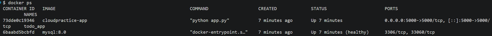
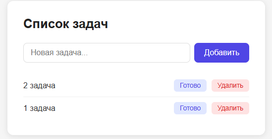
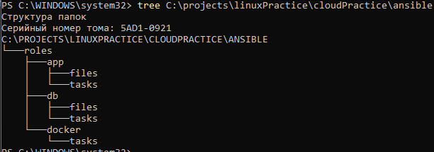

# Отчёт по практической работе «Облако»

**Студент:** Кулаков Родион Андреевич  
**Дата рождения:** 13.08.2003  
**Дата выполнения:** 2026-05-23

---

## Цель работы

Развернуть веб-приложение (Todo-список) с базой данных MySQL на двух виртуальных машинах с использованием инструмента автоматизации Ansible.

В качестве альтернативы облачным ВМ (согласовано с преподавателем) использованы два Docker-контейнера на локальной машине.

---

## Архитектура решения

```
[VM1 — Приложение]              [VM2 — База данных]
  todo_app                         todo_db
  Flask (порт 5000)   <──────>    MySQL (порт 3306)
  Python 3.12 Alpine               mysql:8.0
```

### Стек технологий

| Компонент | Технология |
|-----------|-----------|
| Веб-приложение | Python 3.12, Flask 3.0.3 |
| База данных | MySQL 8.0 |
| Контейнеризация | Docker, Docker Compose |
| Автоматизация развёртывания | Ansible (playbook + roles) |

---

## Реализованные компоненты

### 1. Веб-приложение (`app/app.py`)

Flask-приложение с четырьмя маршрутами:
- `GET /` — вывод списка задач из MySQL
- `POST /add` — добавление новой задачи
- `POST /toggle/<id>` — отметить задачу как выполненную / невыполненную
- `POST /delete/<id>` — удаление задачи

Конфигурация через переменные окружения (для переносимости между средами):

```python
DB_CONFIG = {
    "host": os.getenv("DB_HOST", "db"),
    "user": os.getenv("DB_USER", "todo_user"),
    "password": os.getenv("DB_PASSWORD", "todo_pass"),
    "database": os.getenv("DB_NAME", "todo_db"),
}
```

### 2. База данных (`db/init.sql`)

```sql
CREATE TABLE IF NOT EXISTS todos (
    id    INT AUTO_INCREMENT PRIMARY KEY,
    title VARCHAR(255) NOT NULL,
    done  TINYINT(1)   NOT NULL DEFAULT 0
);
```

### 3. Ansible-роли для автоматического развёртывания

Структура ролей:
- **docker** — установка Docker CE на Ubuntu 22.04
- **db** — развёртывание MySQL-контейнера
- **app** — сборка и запуск Flask-приложения

Сценарий запуска (`playbook.yml`):
```yaml
- name: Install Docker on all VMs
  hosts: all
  roles: [docker]

- name: Deploy MySQL on DB server
  hosts: db_servers
  roles: [db]

- name: Deploy Todo App on App server
  hosts: app_servers
  roles: [app]
```

---

## Результаты выполнения

### Скриншот 1 — Запущенные контейнеры

Команда `docker ps` подтверждает, что оба контейнера работают:
- `todo_db` (mysql:8.0) — статус **healthy**
- `todo_app` — статус **Up**, порт 5000 проброшен на хост



### Скриншот 2 — Работающее веб-приложение

Браузер открыт на `http://localhost:5000`. Приложение отображает список задач, добавленных в MySQL. Доступны кнопки «Готово» и «Удалить» для каждой задачи.



### Скриншот 3 — Структура Ansible-проекта

Дерево файлов показывает организацию ролей Ansible:

```
ansible/
├── inventory.ini
├── playbook.yml
└── roles/
    ├── app/
    │   ├── files/   (docker-compose.yml, app.py, Dockerfile, ...)
    │   └── tasks/   (main.yml)
    ├── db/
    │   ├── files/   (docker-compose.yml, init.sql)
    │   └── tasks/   (main.yml)
    └── docker/
        └── tasks/   (main.yml)
```



---

## Вывод

В ходе работы было создано и развёрнуто Todo-приложение на двух изолированных «машинах» (Docker-контейнерах). Автоматизация развёртывания реализована через Ansible с тремя ролями: установка Docker, запуск базы данных, запуск приложения. Приложение успешно подключается к MySQL и обеспечивает полный CRUD для управления задачами.
